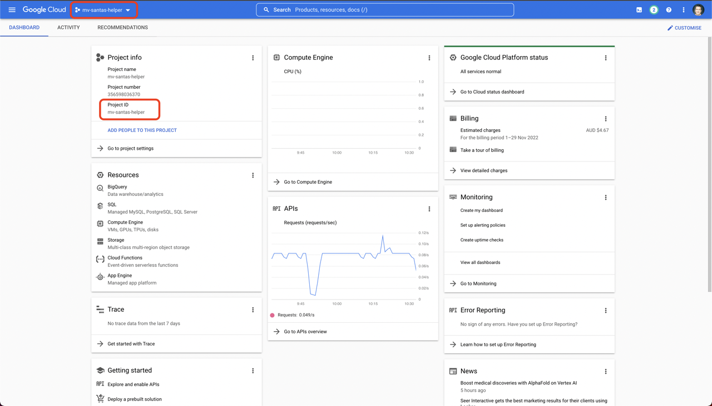

# Santa's Helper

This is the companion code for the [Santa's Helper](https://docs.google.com/document/d/16in8wS8Vl2UvQOYwDxwge8FPpDANxWRkxi4IcCMBa8o/edit#) 
blog. The blog explains what the code is trying to do, but focuses on the logic output - rather than the "how to". 
This code is the "how to".

In order to setup and run this code, you will need a [Google Cloud](https://cloud.google.com/) account, with a 
credit card attached (this project requires some paid resources - although it won't cost much to run so long 
as you shut everything down once you've finished).

Next, create a new project in your GCP (Google Cloud Platform) account. The one used here and with the demonstration 
has a project id of `mv-santas-helper` (if you let Google select a random project id, you can see what it is 
by navigating to the `Cloud Overview` page).

## Technology

There are a number of technologies used for this project, which are listed below along 
with their respective usages.

- [BigQuery](https://cloud.google.com/bigquery) - Used as the underlying RDB (Relational Database). Sample child & 
  present data is created using views. Additional views are then added as required in order to 
  obtain the *score* for every child/parent combination.
- [Vertex AI](https://cloud.google.com/vertex-ai/) - Specifically, we are using a hosted/managed 
  [Jupyter](https://jupyter.org/) Notebook to review the data in BigQuery and demonstrate the allocation logic.

## Setup Steps

There are few steps required to setup your environment to make all the code run. These are listed below - in the 
order they should be executed.

- [Notebook Setup](etc/docs/notebook-setup.md) - Setting up the managed Jupyter Notebook in GCP
- [Service Account Setup](etc/docs/service-acc-setup.md) - Setting up the GCP Service Account - required by the 
  Jupyter Notebook to create and access the data in BigQuery.
- [BigQuery Setup](etc/docs/bigquery-setup.md) - Initialising BigQuery for use by the Notebook

