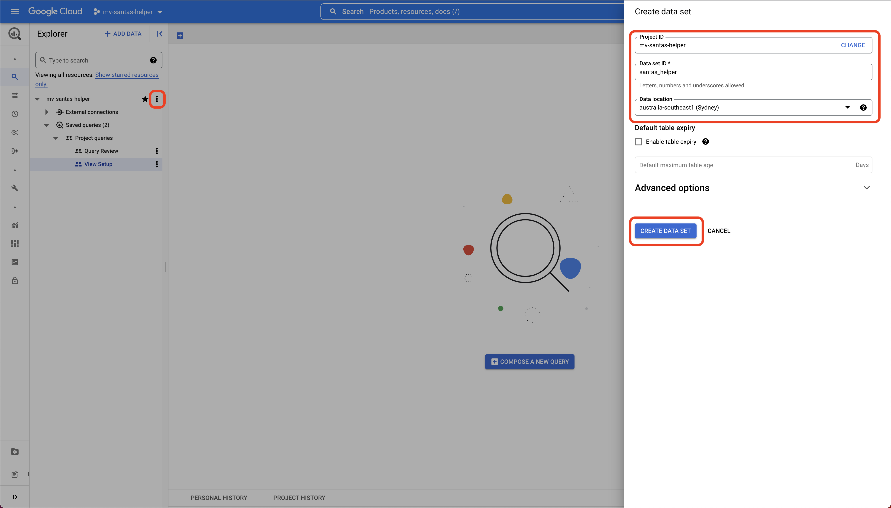

# BigQuery Setup

The Juypter Notebook will execute the [setup-views.sql](../../allocation/sql/setup-views.sql) - which creates 
all the sample data, and *score* calculations described in the blog. However, first a `dataset` is required 
in which to create the tables (think of a `dataset` as a `schema` in a traditional RDB).

## Create Dataset

Navigate to `BigQuery`, click on the vertical ellipsis `...`, enter a name and location for the dataset and click 
the `CREATE DATA SET` button.

You should now see the dataset listed under the project name. Make a note of the dataset id - in this example its
`santas_helper`. Take note of the dataset id as it is required in order to run the notebook correctly.

*Note: you can only use underscores `_`, rather than dashes `-`, as names for datasets*

Once the notebook creates all the views, you will see them listed under the dataset as follows - where you 
can run SQL in the console in order to interrogate them and review the data etc.

*Tip: to refresh the data under the dataset without having to reload the page, put the cursor in the `Type to search` 
input box and click enter. The dataset will now reflect any changes - such as the views being created by the 
notebook*

Now we're ready to run the notebook and see how all the logic works.

- Next - [Running the Notebook](running-the-notebook.md)
