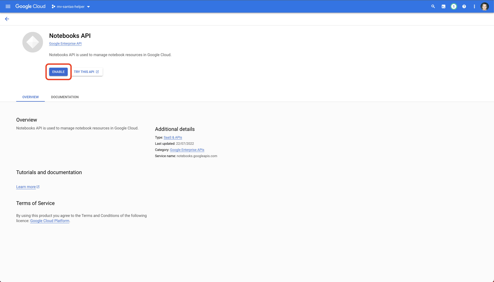
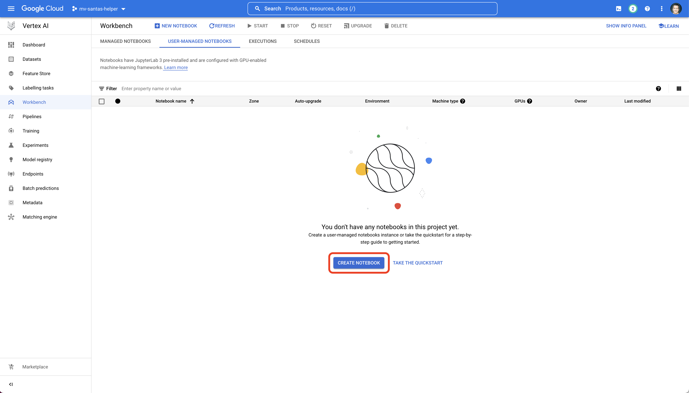
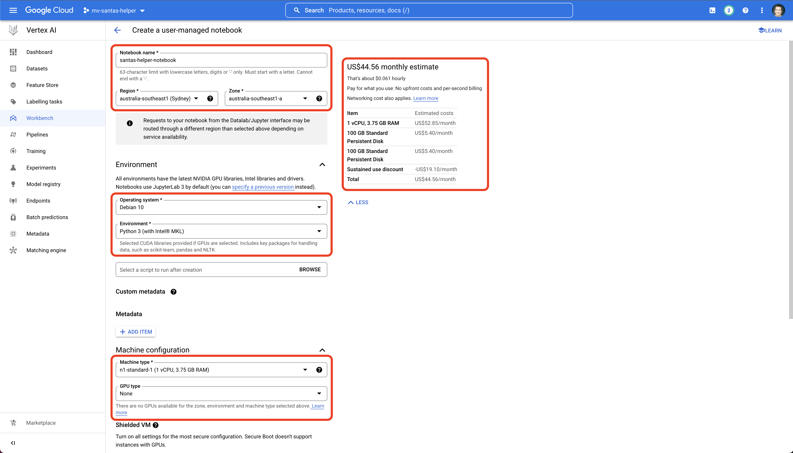
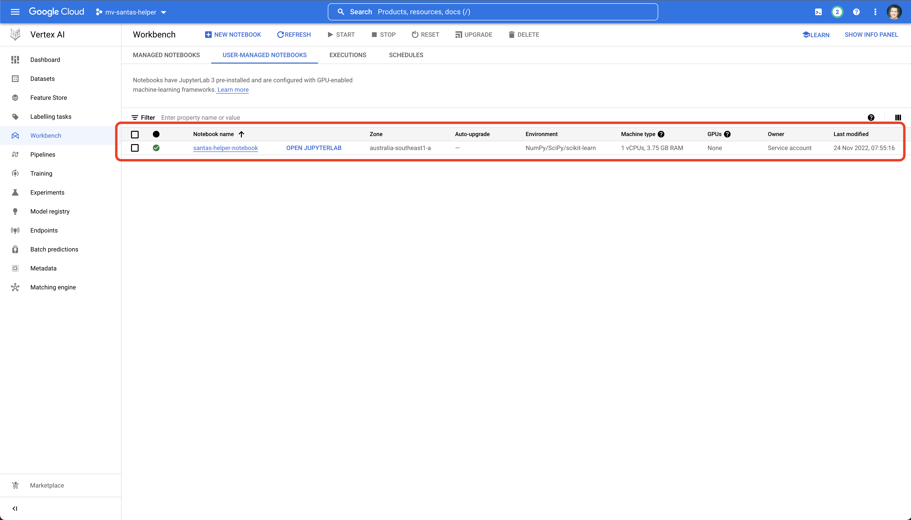
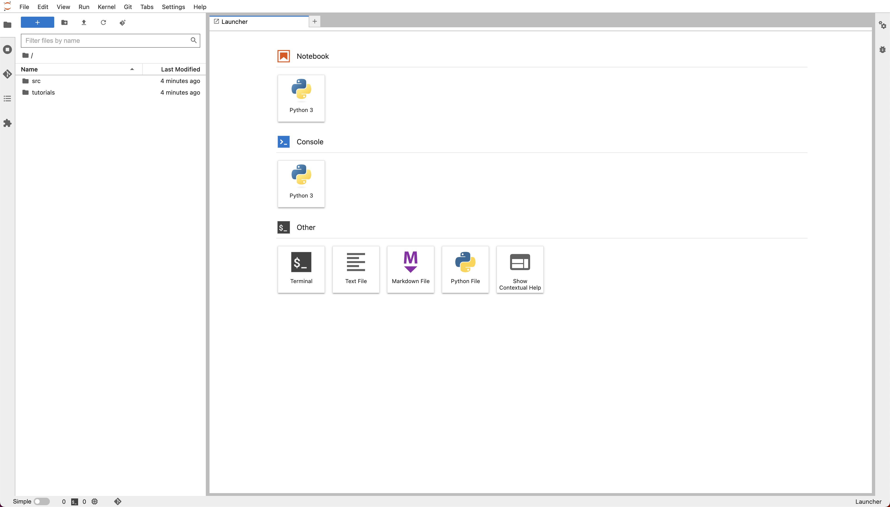

# Jupyter Notebook Setup

This section describes how to setup the managed Jupyter Notebook - part of the `Workbench` section in GCP's `Vertex AI` 
offering.

## Enable the API

When you first navigate to this screen, you will be required to initialise the API.

## Create Notebook

Once initialised, you'll need to create a new notebook.

We don't need anything fancy for this notebook, just the ability to run Python code in a Jupyter Notebook, so pick the 
minimal options as shown below.

*Note: take note of the estimated cost - this is what you're going to be up for if you don't turn the machine off 
once you've finished with it :-)*

## Review

Once the machine has been created, you should see it listed.

You can see here that the machine is running (via the **green** circle).

**Do not forget to turn the machine off when you're finished!**

You can easily restart it again, but you won't be charged for the machine unless it's running.

When you click on the `OPEN JUPYTERLAB` you will be taken to the following starter page.

However, before you can use the Notebook for this demonstration, there are a few more setup steps required.

- Next - [Service Account Setup](service-acc-setup.md)

