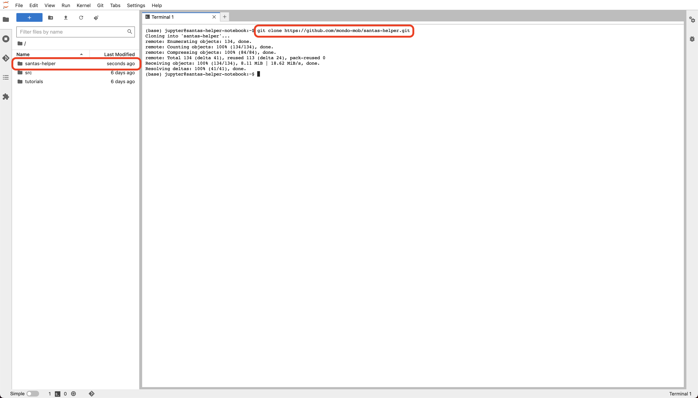

# Running the Notebook

Finally onto the fun stuff! As described in the [Notebook Setup](notebook-setup.md), open the Jupyter Notebook 
using the `OPEN JUPYTERLAB` button. From the default homepage, select `Terminal` to open a command prompt.


## Checkout code

This is a public repo is stored in Github. To bypass firewalls etc, use `https` rather than `ssh` to `clone` 
the repository. I.e.



The command used at the root of the terminal is:

```
git clone https://github.com/mondo-mob/santas-helper.git
```

Note the following: 

- `git` is already installed on the notebook machine.
- In the example, this repository was private - so credentials were required in order to clone the code. You will 
  not need to perform this authentication step

## File structure

Once cloned, this will create the directory `santas-helper` at the root. Close the terminal and double click into 
this root to see the files. The directory structure is as follows:

- `santas-helper`
  - `etc` - documentation, image etc
  - `allocation` - where the allocation logic, code etc resides.
    - `sql` - contains any SQL scripts - in this case [setup-views.sql](../../allocation/sql/setup-views.sql)

Navigate to the `allocation` Directory.


The files in this directory have the following purposes:

- [lib.py](../../allocation/lib.py) - helper methods/classes required by the notebook (to prevent cluttering up the 
  notebook with logic not directly related to solving the problem)
- [requirements.tx](../../allocation/requirements.txt) - list of library dependencies required by the notebook (and 
  also installed by the notebook as one of the steps)
- [SantasHelper.ipynb](../../allocation/SantasHelper.ipynb) - the Jupyter Notebook containing the setup and allocation
  logic.

## Service Account Setup

The Service Account created and downloaded in the [Service Account Setup](service-acc-setup.md) section and renamed 
`configuration.json` now needs to be uploaded to the notebook machine.


Once done, the `configuration.json` key will be in the same directory as the `SantasHelper.ipynb` file.

## Running the Notebook

We can now open the notebook (by double clicking on the `SantasHelper.ipynb` file) which will start the underlying Kernel 
to execute the python code.


In the first cell, you will need to update the `project_id` and `dataset_id` to match your environment (you can also 
change the service account key if it isn't named `configuration.json`). I.e.

```
project_id='mv-santas-helper'
dataset_id='santas_helper'
service_acc_file='configuration.json'
```

Yon can now step through each cell to run it, by clicking on the Go Arrow at the top of the notebook.


Any cell that has been successfully executed, will have a number next to it - indicating the order in which it was 
run. The currently selected cell will have a blue bar next to it. Clicking the Go Arrow will run this cell and move 
onto the next.

You can now work your way through the notebook - which has comments in each of the cells to describe their intent. The 
majority of the cells will also produce output to demonstrate what is going on.

Happy Allocating, and Merry Christmas from the Mondo Team! x


