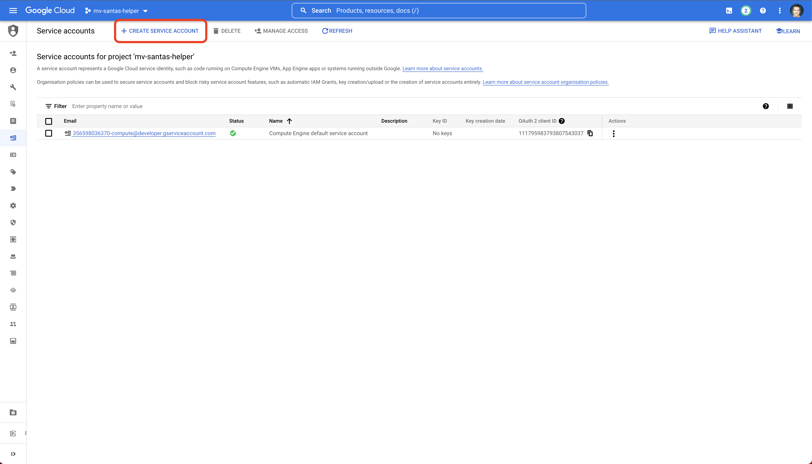
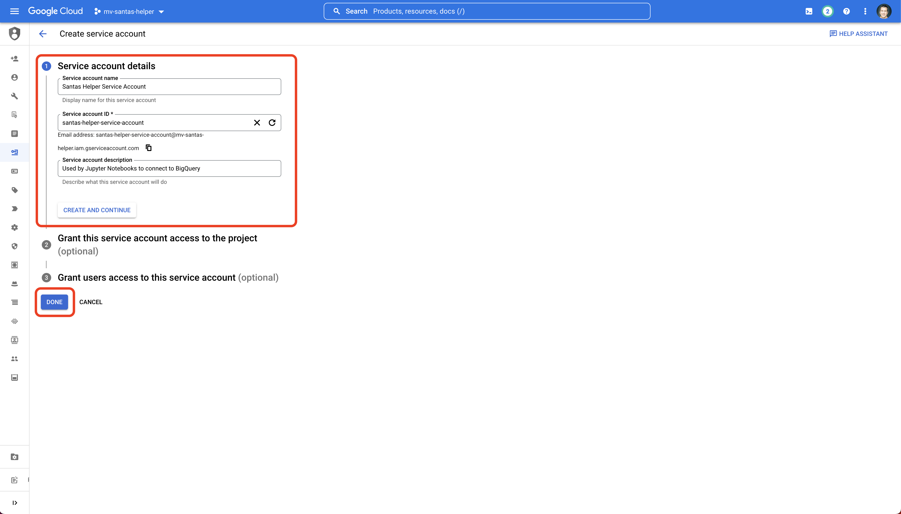
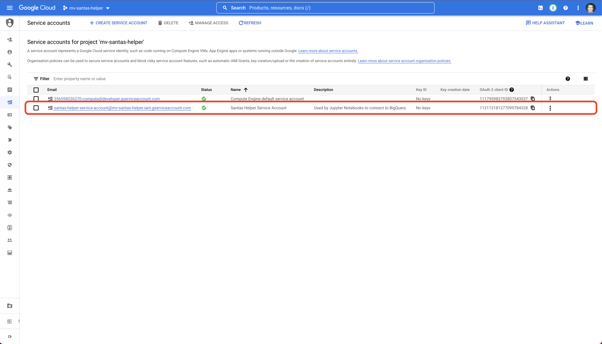
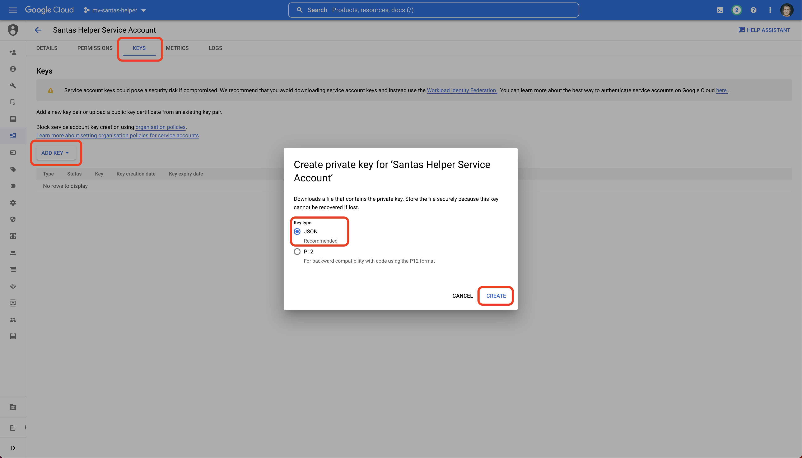
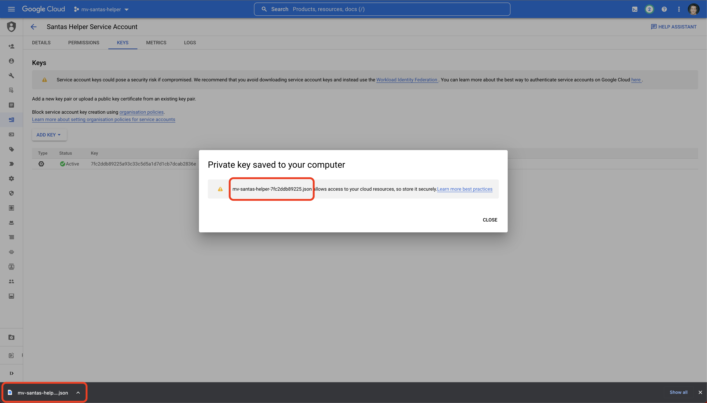
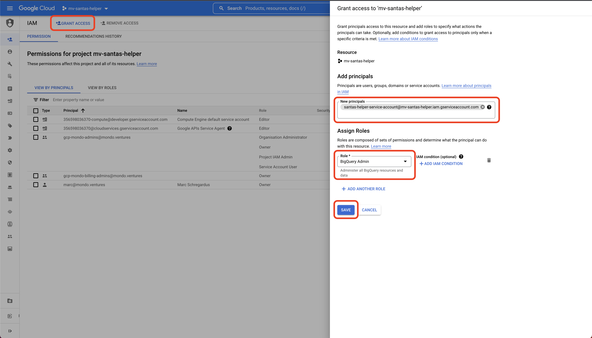
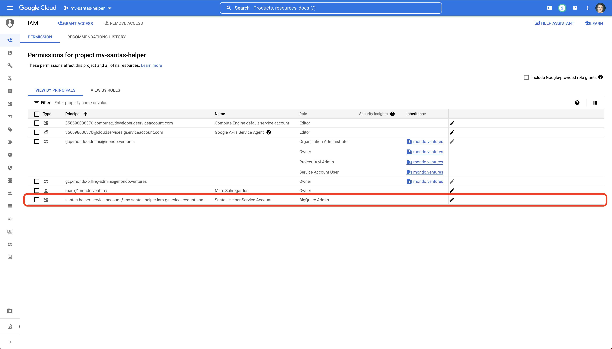

# Service Account Setup

A [Service Account](https://cloud.google.com/iam/docs/service-accounts) - which is a special type of account used by 
machines, rather than humans - is required by the Jupyter Notebook in order to access BigQuery. We will need to create 
this account, assign it the correct permission(s), the provide a way that the python code in the notebook can 
access it.

## Create Service Account

Navigate to `IAM and admin` -> `Service Accounts` and click on the `CREATE SERVICE ACCOUNT` button at the 
top of the page.

Add the service account details (the service account id for this example is `santas-helper-service-account`). 
Click `Done` to create the account

You should see the account listed.

## Create Service Account Key

The python code uses a *key* to use the service account's credentials. This key is simply a JSON file that provides 
all the details for the service account.

**Note: do not check this key into any code! Delete it once it's no longer required**

Click into the service account details, and from the `KEYS` tab, choose to `ADD KEY`. Ensure you've 
selected `JSON` as the key type.

Download the key (you can only do this once, so don't loose it).

You will need to rename this key to `configuration.json` and place this in the same directory as the 
`SantasHelper.ipynb` notebook - but his is explained in more detail in a later section.

## IAM Setup

We now need to give the Service Account access to BigQuery. We need to write to BigQuery (to setup the data/views) as 
well as read (to allocate the presents using the scores). The simplest way to do this is to assign a single 
role `BigQuery Admin`. I.e.

Note: we chose the full name of the service account (the name after the `@` symbol is determined by youre project id - so 
for this example, we use `santas-helper-service-account@mv-santas-helper.iam.gserviceaccount.com`).

Now when we review the IAM permissions for our project, we should see something similar to:

We now need a few steps to setup BigQuery for this demo.

- Next - [BigQuery Setup](bigquery-setup.md)
